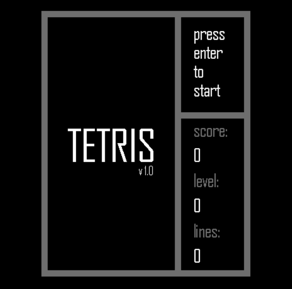
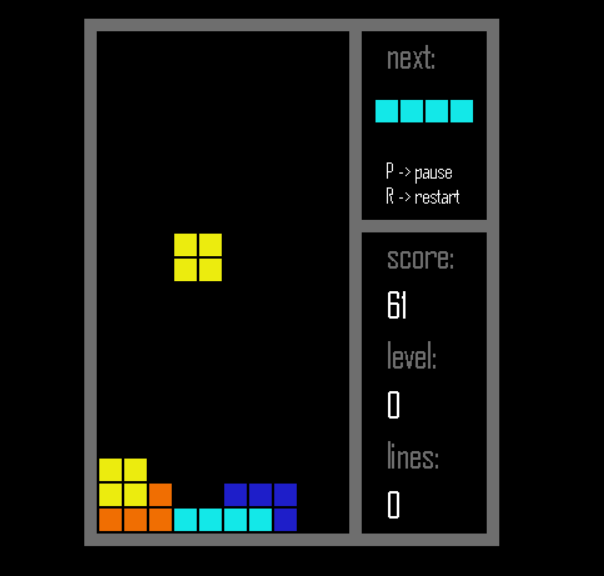
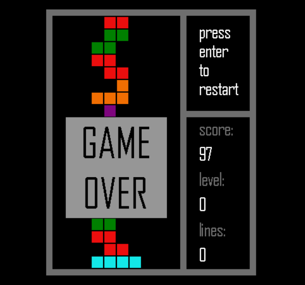

# tetris-python
A tetris game coded in python.

The code worked with the following Python 3 and Pygame versions:

Python 3.9.0, pygame 2.0.1 (Tested in May 2021)

Python 3.7.4, pygame 1.9.6 (Tested in Sep 2019)

Python 3.6.5, pygame 1.9.3 (Tested in May 2018)

## Installation Guide (Windows 10)

Install the latest versions of Python 3 and PIP, refer to:

https://phoenixnap.com/kb/how-to-install-python-3-windows

https://phoenixnap.com/kb/install-pip-windows

Install the latest version of Pygame:
https://www.pygame.org/wiki/GettingStarted

Open command prompt, go to the directory of the file "tetris.py", type "py tetris.py" and the game should begin.

If it doesn't work with the latest ones, you can try installing the earlier versions:

https://www.python.org/downloads/

https://www.pygame.org/download.shtml

## Game Controls

Right arrow -> Move the piece to the right

Left arrow -> Move the piece to the left

Down arrow -> Drop the piece

Up arrow -> Rotate the piece clockwise

Shift -> Rotate the piece counterclockwise

R -> Restart

P -> Pause/Unpause

ESC -> Quit

Space -> Hard Drop (requires upgrade)

B -> Bomb (requires upgrade)

H -> Hold current piece (requires upgrade)

## Persistent Upgrades

Upgrades are stored per player in `upgrades.json` under `players[<name>]`.

| Key                           | Effect                                                     |
|-------------------------------|------------------------------------------------------------|
| `hard_drop`                   | Unlocks the Space-bar hard drop                            |
| `preview_plus`                | Adds additional next-piece previews (base is always one)   |
| `hold_unlocked`               | Unlocks the hold slot (press `H` to swap the active piece) |
| `bomb_unlocked & bomb_blocks` | Unlocks the bomb piece (press `B` to use)                  |

## Screenshots

